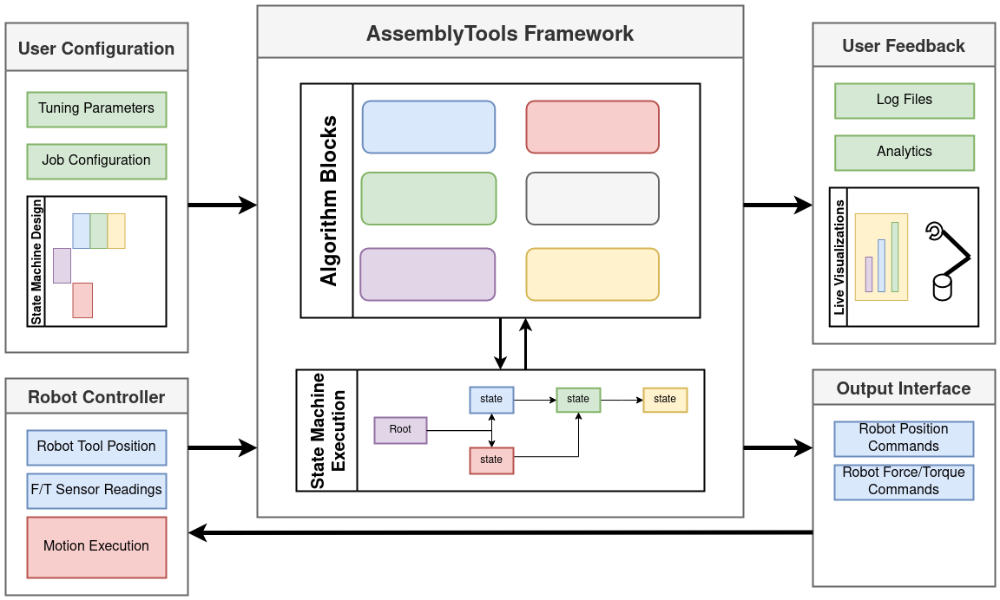

# ConnTact

Software framework to enable agile robotic assembly applications.

(Connect + Tactile)

## Overview

The ConnTact package provide a efficient framework for assembly algorithm development for compliant robots. It allows the user to define fully tactile methods for making tight-tolerance connections in a human-like way.

ConnTact includes an implementation of the [transitions](https://github.com/pytransitions/transitions) state machine package to define the steps and decisions critical to your algorithm. It also provides a suite of tools and examples to sense the environment based on force feedback - detecting collision, hard surfaces, and position changes. Finally we define some basic motion profiles which can be used to probe the environment and align the tool to the workpiece.

## Installation

Development of framework was done under Ubuntu Focal (20.04) using ROS Noetic.

  - Clone the repository into the `src/` directory of a ROS workspace (e.g., `~/ros_ws/src`)
  - Install Python dependencies `pip install transitions modern_robotics`
  - Install ROS source dependencies:
    - `cd ~/ros_ws/src`
    - `vcs import < conntact/dependencies.rosinstall`
  - Install ROS package dependencies: `rosdep install --rosdistro noetic --ignore-src --from-paths .`
  - Source ROS and build the workspace: `. /opt/ros/noetic/setup.bash`, `catkin build`

## Examples

The repository is currently set up with examples that demonstrate assembly tasks for the [NIST assembly task board](https://www.nist.gov/el/intelligent-systems-division-73500/robotic-grasping-and-manipulation-assembly/assembly) using a Universal Robots UR10e. Currently two algorithms are implemented that perform peg insertion tasks using a vertical searching method and a corner-contact searching method to find the holes.

First, by jogging the UR manually, locate the corner of the NIST task board in the robot's base frame. Update the expected position of the board in

To run these examples, open a terminals sourced to the built project workspace and run:

    roslaunch conntact ur10e_upload_compliance.launch algorithm_selected:=<algorithm>

Where `<algorithm>` is either `spiral_search_node` or `corner_search_node`.

## Usage

### Setting up a workcell

### Configuring a new application

## Acknowledgements

This project is primarily supported by the National Institute of Standards and Technology through the [Agile Performance of Robotic Systems](https://www.nist.gov/programs-projects/agility-performance-robotic-systems) program under grant award number 70NANB21H018
