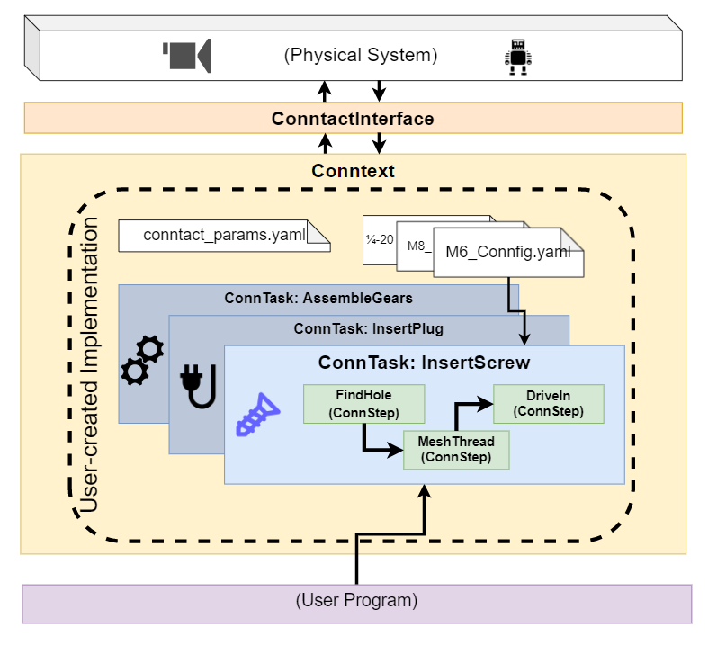
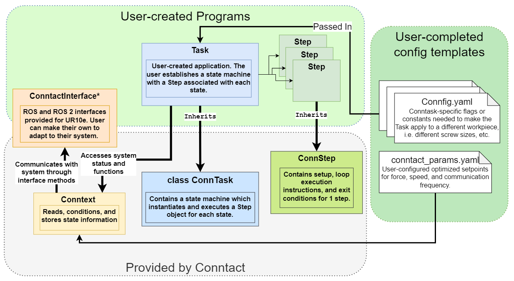

# ConnTact

**A software framework to enable agile robotic assembly applications.**


Etymology:

**_Conn_** (intransitive verb)
 to conduct or direct the steering of (a vessel, such as a ship)

**_Tact_** (noun)
 Careful delicacy to achieve a purpose without causing harm

_Alternative etymology: Connect + Tactile_

## Overview

The ConnTact package provide an efficient framework for assembly algorithm development for compliant robots. It allows the user to define fully tactile methods for making tight-tolerance connections in a human-like way.

ConnTact includes an implementation of the [transitions](https://github.com/pytransitions/transitions) state machine package to define the steps and decisions critical to your algorithm. It also provides a suite of tools and examples to sense the environment based on force feedback - detecting collision, hard surfaces, and position changes. Finally we define some basic motion profiles which can be used to probe the environment and align the tool to the workpiece.



The above diagram illustrates the topology of a Conntact implementation. The user's main program sets up the ConnTact environment by starting up persistent Conntext and ConntactInterface objects. These manage environment communication and interpretation. Then, the user program can run sequential ConnTasks in this prepared environment to carry out different manipulation tasks.

The ConnTask is the basic unit of ConnTact implementation: it's a user-created state machine describing an algorithmic solution to a problem. ConnTasks are easy to build and test in ConnTact as long as you can break down the human method into discrete motions and decisions. Here we show that the user has developed a screw-driving Task, a plug-insertion Task, and a gear-assembling Task.  

We show that the ConnTask has a few ConnStep objects inside. These are simple definitions of motion and end conditions which give executable meaning to the ConnTask state machine states.

Above the InsertScrew ConnTask we show some Connfig files, each for a different size of screw. ConnTasks are, at least by default, easy to parameterize. If the algorithm stays the same, any numerical values should be easily tweakable for different workpieces.

## Installation

Development of framework was done under Ubuntu Focal (20.04) using [ROS Noetic](http://wiki.ros.org/noetic).
  - If not previously installed, install [vcstools](http://wiki.ros.org/vcstool) and [catkin-tools](https://catkin-tools.readthedocs.io/en/latest/installing.html).
  - Initialize ROS workspace (e.g., `mkdir -p ~/ros_ws/src`, `cd ~/ros_ws/`, `catkin init`)
  - Clone the repository into the `src/` directory of a ROS workspace (e.g., `~/ros_ws/src`)
  - Install Python dependencies `pip install transitions modern_robotics`
  - Install ROS source dependencies:
    - `cd ~/ros_ws/src`
    - `vcs import < ConnTact/dependencies.rosinstall` 
  - Install ROS package dependencies: `rosdep install --rosdistro noetic --ignore-src --from-paths .`
  - Source ROS and build the workspace: `. /opt/ros/noetic/setup.bash`, `catkin build`

## Structure



ConnTact is structured with 4 levels of functionality:

#### ConntactInterface

 The Interface defines the complete list of abstract functions which ConnTact uses to interact with a computer-robot system (hardware and software environment). As long as these functions are implemented as intended, ConnTact will run on any hardware and will command any robot. We provide working Interface examples for the UR10e running in both ROS and ROS 2 (coming soon).

#### Conntext

  The Conntext package acts as a wrapper which translates world-space data from the interface into the _task space_: the frame-of-reference of the task to be accomplished. This way, an algorithm is automatically reoriented and repositioned to each job, i.e. different hole positions and orientations for a screw-driving application. Conntext also provides useful data utilities, such as speed estimation and sensor data filtering.

#### ConnTask

  To use ConnTact, the user creates a ConnTask implementation. Conntask is an easily-reconfigurable state machine which automatically associates an ConnStep behavior (see below) with each state and transition. Once you break a job down into sequential tasks, you can quickly build the functional skeleton of the algorithm.

#### ConnStep

  ConnTask implements tactile sensing in a pairing of *movement profile* and *end conditions*. A *motion profile* describes axes of force, compliance, or resisted motion to be executed by the robot end effector. The motion profile drives the robot through space and along surfaces. An *end condition* is a description of a force, torque, or motion signal which indicates that the robot has encountered a specific feature of interest which should end the motion profile and move the state machine. 
  The ConnStep class makes it extremely easy to first define a motion profile to move the robot through the environment, and then to define the end conditions which indicate that the motion has reached either its goal or an obstacle. Depending on the end condition detected, the ConnStep instructs ConnTask's state machine which specific next step to which to transition.

## Development

We suggest the following workflow to take a task from a human and give it to a robot. We'll use the example of inserting a peg into a hole to illustrate each step. This is the task for which the included `SpiralSearch` example was developed. Snippets of code from `SpiralSearch` are included in collapsed sections to illustrate how little user programming is needed.  

#### 1. Choose the frame-of-reference for your task.
  * The hole is vertical. We'll establish the Z axis to be vertical, concentric with the hole. All positions from here onward will be measured relative to the hole's position and orientation. We also establish the peg's Z axis along its axis pointing away from the robot flange. 

#### 2. Break the human task down into a sequence of tactile *steps* and *decisions*.
  * Roughly align the Z axes of the peg with the expected hole position by sending it to the task-space position (x, y, z) = (0,0,10). We specify that the robot begin to search for the surface of the assembly board from a safe height (10 cm) to prevent accidental collision. 
  * Move the peg downward (-z) until it hits the surface where the hole is bored.
  * Measure the exact surface height for later reference.
  * Slide the peg along the surface in an outward spiral until it catches in the hole and falls below the detected surface by 1 mm. If not detected, return to the center and try again.
  * Once the hole location is found, push the peg downward as far as possible, complying in all axes. The compliant robot will automatically align with the hole in orientation and position.
  * When the robot reaches a static obstacle that stops the peg's motion, the insertion is complete!
  * Retract the robot to reset the test.

#### 3. Define the state machine based on this plan.

  The pytransitions package makes state machine setup very straightforward, and Conntact doesn't need much more information to carry out its job.

  The SpiralSearch example follows the steps laid out in **2** very closely; however, there are a few items not discussed above which we have built into ConnTact.
  - There is one required transition for all ConnTask state machines, shown below. This is a _reflexive_ transition; that is, it leads from any state back to the same state. This permits every loop cycle to end by returning a trigger. This reflexive trigger also activates the current ConnStep's `execute` code through the `run_step_actions` callback, creating the motion behavior commanded. Don't leave this out!
    `{'trigger':RUN_LOOP_TRIGGER          , 'source':'*'                 , 'dest':None, 'after': 'run_step_actions'}`
  - ConnTact is currently equipped with a safety retraction feature. This feature protects the robot and workcell from damage from unexpected robot motion or runaway feedback oscillation, which is always a danger when running a robot with realtime control rather than planned paths. If forces rise above a specified level for a specified time, the state machine receives a `SAFETY_RETRACTION_TRIGGER` which cancels the current task and moves to a `SAFETY_RETRACT_STATE` where the robot complies gently with the environment and tries to pull up and away from the surface. This transition, and the transition back to the start of the task, have to be included in any state machine you create in order to retain this functionality. See the "SpiralSearch example" code snippets below.
  - Conntact provides `EXIT_STATE` as an easy way to leave the command loop and return control to the user program (that which instantiated the ConnTask). To use this function, always define this state and a transition to it.
  


##### First define the state machine states:
<details><summary>Click to view SpiralSearch example</summary>

```
states = [
START_STATE,
APPROACH_STATE,
FIND_HOLE_STATE, 
INSERTING_PEG_STATE, 
COMPLETION_STATE,
EXIT_STATE,
SAFETY_RETRACT_STATE
]
```


</details>

##### Next define the valid transitions between these states. 

<details><summary>Click to view SpiralSearch example</summary>

```
transitions = [
{'trigger':APPROACH_SURFACE_TRIGGER  , 'source':START_STATE         , 'dest':APPROACH_STATE         },
{'trigger':STEP_COMPLETE_TRIGGER     , 'source':APPROACH_STATE      , 'dest':FIND_HOLE_STATE        },
{'trigger':STEP_COMPLETE_TRIGGER     , 'source':FIND_HOLE_STATE     , 'dest':INSERTING_PEG_STATE    },
{'trigger':STEP_COMPLETE_TRIGGER     , 'source':INSERTING_PEG_STATE , 'dest':COMPLETION_STATE       },
{'trigger':STEP_COMPLETE_TRIGGER     , 'source':COMPLETION_STATE    , 'dest':EXIT_STATE             },
{'trigger':SAFETY_RETRACTION_TRIGGER , 'source':'*'                 , 'dest':SAFETY_RETRACT_STATE,
'unless':'is_already_retracting' },
{'trigger':STEP_COMPLETE_TRIGGER     , 'source':SAFETY_RETRACT_STATE, 'dest':APPROACH_STATE         },
{'trigger':RUN_LOOP_TRIGGER          , 'source':'*'                 , 'dest':None, 'after': 'run_step_actions'}
]
```


</details>

#### 4. Analyze each *step* and determine the *motion profile* and *end conditions.*

For each step above, identify the *force directions* and *free movement directions* required. 

<details><summary>Some info about our basic motion profile function, `arbitrary_axis_comply`</summary>
ConnSteps by default use a simple motion profile definition.

First, it establishes a force command and a compliance policy. These are simply X, Y, and Z axes.

```
self.seeking_force = [0,0,0]
self.comply_axes = [1,1,1]
```

Each loop cycle, it uses these commands to output the position and orientation instructions which will be published for robot execution.

```
def update_commands(self):
    '''Updates the commanded position and wrench. These are published in the ConnTask main loop.
    '''
    #Command wrench
    self.assembly.wrench_vec  = self.conntext.get_command_wrench(self.seeking_force)
    #Command pose
    self.assembly.pose_vec = self.conntext.arbitrary_axis_comply(self.comply_axes)
```

The force command described by seeking_force here is used to guide robot motion. If a force is commanded, the robot will move until that force is cancelled by an external collision force of equal magnitude. This slowly moves the robot along a compliant direction.

The robot will comply along each axis marked with a 1 in `comply_axes`. The robot will attempt to match axes marked with a 0 to a commanded target position, normally the position of the hole. This is useful, for example, when first seeking a hole at a given position. The robot aligns in X and Y with the hole, and moves compliantly in Z in order to collide perpendicularly with the surface.

This allows the robot to continuously move in a predictable way.

</details>

* To move the peg downward in free space until it hits a hard surface:
  * Apply a small downward force to move the robot downward.
  * Comply in the vertical (z) direction - move as the force assigned above dictates.
  * Do not comply in horizontal directions (x and y); assign the expected hole location to these dimensions.
  * Do not comply in orientation.
  * Exit when a static obstacle stops the robot's motion
  * Save the Z position of the surface so that, later, we can determine if we pass it by falling into the hole.

To realize this behavior in an ConnStep, you only need override the `seeking_force` and `comply_axes` that are initialized by the base classes. 

```
ConnStep.__init__(self, connTask)
self.comply_axes = [0, 0, 1]
self.seeking_force = [0, 0, -7]
```

To end the step when collision is detected, simply override the `exit_conditions` method.

`return self.is_static() and self.in_collision()`

<details><summary>FindSurface as ConnStep</summary>

```
class FindSurface(ConnStep):

    def __init__(self, connTask: ConnTask) -> None:
        ConnStep.__init__(self, connTask)
        self.comply_axes = [0, 0, 1]
        self.seeking_force = [0, 0, -7]

    def exit_conditions(self) -> bool:
        return self.is_static() and self.in_collision()

    def on_exit(self):
        """Executed once, when the change-state trigger is registered.
        """
        # Measure flat surface height and report it to AssemblyBlocks:
        self.assembly.surface_height = self.conntext.current_pose.transform.translation.z
        return super().on_exit()
```

</details>

The spiral search pattern is realized by changing the command position according to a formula. The robot is sent to the commanded position repeatedly, so it moves smoothly outward. The underlying active compliance is still enabled, and we permit total compliance in `z` so that the peg can drop into the hole.

<details><summary>SpiralToFindHole ConnStep</summary>

```
class SpiralToFindHole(ConnStep):
    def __init__(self, connTask: (ConnTask)) -> None:
        ConnStep.__init__(self, connTask)
        self.seeking_force = [0, 0, -7]
        self.spiral_params = self.assembly.connfig['task']['spiral_params']
        self.safe_clearance = self.assembly.connfig['objects']['dimensions']['safe_clearance']/100 #convert to m
        self.start_time = self.conntext.interface.get_unified_time()

    def update_commands(self):
        '''Updates the commanded position and wrench. These are published in the ConnTask main loop.
        '''
        #Command wrench
        self.assembly.wrench_vec  = self.conntext.get_command_wrench(self.seeking_force)
        #Command pose
        self.assembly.pose_vec = self.get_spiral_search_pose()

    def exit_conditions(self) -> bool:
        return self.conntext.current_pose.transform.translation.z <= self.assembly.surface_height - .0004

    def get_spiral_search_pose(self):
        """Generates position, orientation offset vectors which describe a plane spiral about z;
        Adds this offset to the current approach vector to create a searching pattern. Constants come from Init;
        x,y vector currently comes from x_ and y_pos_offset variables.
        """
        # frequency=.15, min_amplitude=.002, max_cycles=62.83185
        curr_time = self.conntext.interface.get_unified_time() - self.start_time
        curr_time_numpy = np.double(curr_time.to_sec())
        frequency = self.spiral_params['frequency'] #because we refer to it a lot
        curr_amp = self.spiral_params['min_amplitude'] + self.safe_clearance * \
                   np.mod(2.0 * np.pi * frequency * curr_time_numpy, self.spiral_params['max_cycles']);
        x_pos = curr_amp * np.cos(2.0 * np.pi * frequency * curr_time_numpy)
        y_pos = curr_amp * np.sin(2.0 * np.pi * frequency * curr_time_numpy)
        x_pos = x_pos + self.assembly.x_pos_offset
        y_pos = y_pos + self.assembly.y_pos_offset
        z_pos = self.conntext.current_pose.transform.translation.z
        pose_position = [x_pos, y_pos, z_pos]
        pose_orientation = [0, 1, 0, 0]  # w, x, y, z

        return [pose_position, pose_orientation]
```

</details>

Finally, to follow the peg into the hole, we use a similar setup to the `FindSurface` Step above. This time we allow all axes to comply fully so that the peg experiences minimal friction and aligns more perfectly.

<details><summary>Hole insertion ConnStep</summary>

```
class FindSurfaceFullCompliant(ConnStep):
    def __init__(self, connTask: (ConnTask)) -> None:
        ConnStep.__init__(self, connTask)
        self.comply_axes = [1, 1, 1]
        self.seeking_force = [0, 0, -5]

    def exit_conditions(self) -> bool:
        return self.is_static() and self.in_collision()
```

</details>


That's the majority of the custom programming involved. With this state machine and these Steps, the system can execute the proposed task. You can read through the rest of `SpiralSearch.py` to see how we added plotting capability and used a Connfig to store info about each of the cylindrical pegs in the task board. You can also read through `spiral_search_node.py` to see how we instantiate and run the ConnTask for our ROS+UR10e workcell.

## Running _SpiralSearch_ Example

The repository is currently set up with examples that demonstrate assembly tasks for the [NIST assembly task board](https://www.nist.gov/el/intelligent-systems-division-73500/robotic-grasping-and-manipulation-assembly/assembly) using a Universal Robots UR10e. The system can insert any of the circular pegs into their respective holes. Relative locations of these holes on the board are already recorded in *config/peg_in_hole_params.yaml*.

To run the examples, you must first determine the location and position of the NIST task board (or equivalent). First, by jogging the UR manually, locate the corner of the task board in the robot's base frame. We selected an arbitrary corner to be the board's origin, as shown below.
 


Align the gripper's axes as marked on the board (align the +X axis with that drawn on the board.)


Based on the robot's tcp position as displayed on the "Move" tab of the pendant, update the expected position and Z-axis orientation of the board in `peg_in_hole_params.yaml` under `environment state`:
```
environment_state:
    task_frame:
        position: **[-639, 282, -337]**
        orientation: **[0, 0, 0]**
    kitting_frame:
        position: [640, 544, -502]
        orientation: [0, 0, 0]
```
Now the robot can find the rough locations of each of the circular holes. No need to be perfect; the whole system is designed to overcome small inaccuracies! Next, you can select the peg to be inserted by modifying the `task`:
```
task:
    target_peg: "peg_10mm"
    target_hole: "hole_10mm"
    starting_tcp: "tip"
    assumed_starting_height: 0.0
    restart_height: -0.1
```

To run the example, open a terminals sourced to the built project workspace and run:

    roslaunch conntact conntact_demo.launch


## Acknowledgements

This project is primarily supported by the National Institute of Standards and Technology through the [Agile Performance of Robotic Systems](https://www.nist.gov/programs-projects/agility-performance-robotic-systems) program under grant award number 70NANB21H018
